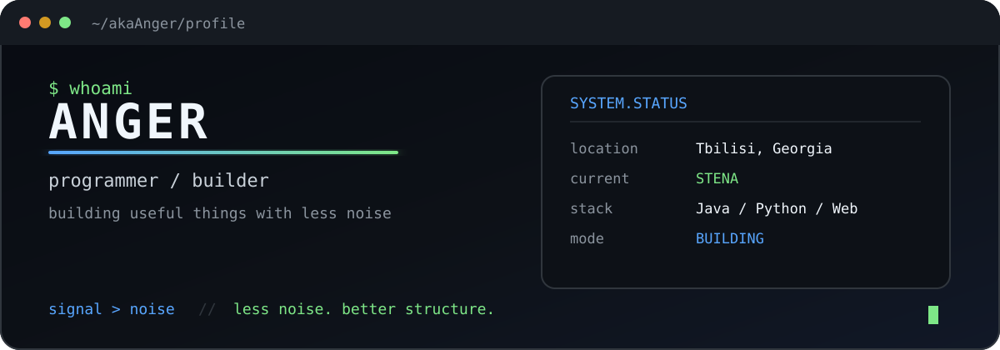
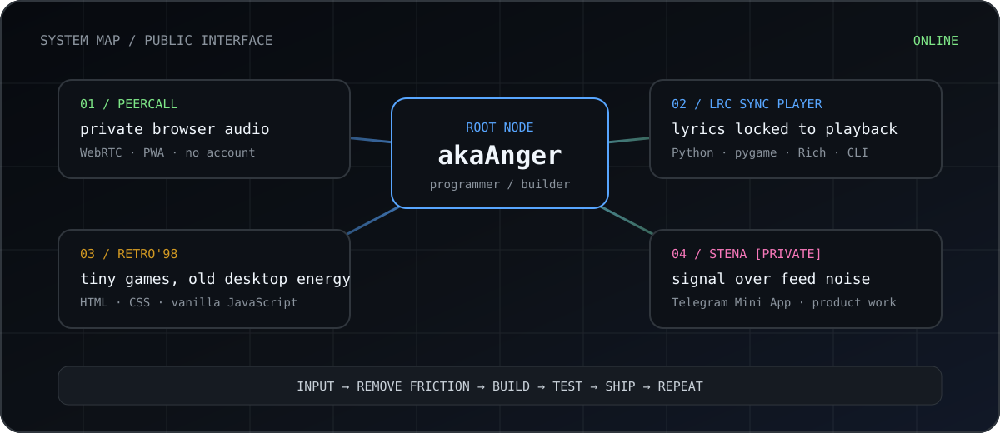
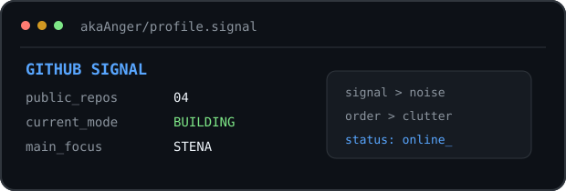
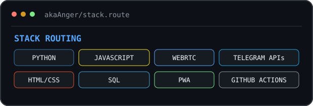

<div align="center">



<br>

`PROGRAMMER` · `BUILDER` · `PRODUCT TINKERER`

**I build small systems that remove unnecessary friction.**

[PROJECTS](#projects) · [STACK](#stack) · [SIGNAL](#signal)

</div>

---

## `BOOT / 00`

```text
> user:      akaAnger
> location:  Tbilisi
> mode:      BUILDING
> target:    useful software
> filter:    signal > noise
> status:    online_
```

Most of my projects start the same way: something feels unnecessarily complicated, slow or noisy — so I build a smaller route around it.

No framework worship. No complexity for decoration. The tool comes first.

---

## `SYSTEM MAP / 01`

<div align="center">



</div>

---

<a id="projects"></a>
## `PROJECTS / 02`

<table>
<tr>
<td width="50%" valign="top">

### `PEERCALL`

**Private one-to-one browser audio calls.**

WebRTC + manual one-time connection codes. No accounts, no signaling backend, no vendor lock-in in the core flow.

[`OPEN REPOSITORY →`](https://github.com/akaAnger/peercall)  
[`LIVE DEMO →`](https://akaanger.github.io/peercall/)

`WebRTC` `PWA` `JavaScript`

</td>
<td width="50%" valign="top">

### `LRC SYNC PLAYER`

**Terminal audio player with synchronized lyrics.**

A compact Python app for local audio and timestamped `.lrc` lyrics, with readable parsing, CLI controls and automated tests.

[`OPEN REPOSITORY →`](https://github.com/akaAnger/lrc-sync-player)

`Python` `pygame` `Rich` `CLI`

</td>
</tr>

<tr>
<td width="50%" valign="top">

### `RETRO'98 MICROGAMES`

**Tiny browser games with old-desktop energy.**

A dependency-free collection of microgames built with plain HTML, CSS and JavaScript in a Windows 98-inspired interface.

[`OPEN REPOSITORY →`](https://github.com/akaAnger/retro98-microgames)

`HTML` `CSS` `Vanilla JS` `Canvas`

</td>
<td width="50%" valign="top">

### `STENA // PRIVATE`

**Current product work.**

A Telegram Mini App project built around a simple principle:

```text
signal  > noise
order   > clutter
control > endless scrolling
```

`Telegram` `Product` `Automation`

</td>
</tr>
</table>

---

<a id="stack"></a>
## `STACK / 03`

<div align="center">


</div>

```text
languages  : JavaScript / Python / HTML / CSS
browser    : WebRTC / PWA / Canvas / WebAudio
data       : SQLite / PostgreSQL
platforms  : Telegram APIs / GitHub Actions
bias       : small, inspectable, useful
```

---

## `BUILD RULES / 04`

<table>
<tr>
<td width="33%" valign="top">

### `01`
**Remove friction**

If the user has to fight the interface, the interface is unfinished.

</td>
<td width="33%" valign="top">

### `02`
**Keep it inspectable**

Readable code beats mysterious cleverness when both solve the same problem.

</td>
<td width="33%" valign="top">

### `03`
**Ship the useful part**

Start with the smallest version that already earns its place.

</td>
</tr>
</table>

---

<a id="signal"></a>
## `SIGNAL / 05`

<div align="center">




</div>

<details>
<summary><code>OPEN /origin.log</code></summary>

<br>

```text
route unavailable
↓
find the friction
↓
build a workaround
↓
make the workaround understandable
↓
turn it into a tool
↓
remove everything the tool does not need
↓
ship
```

</details>

---

<div align="center">

```text
MAKE IT WORK.
MAKE IT CLEAR.
REMOVE THE NOISE.
```

**`akaAnger // still building`**

</div>
